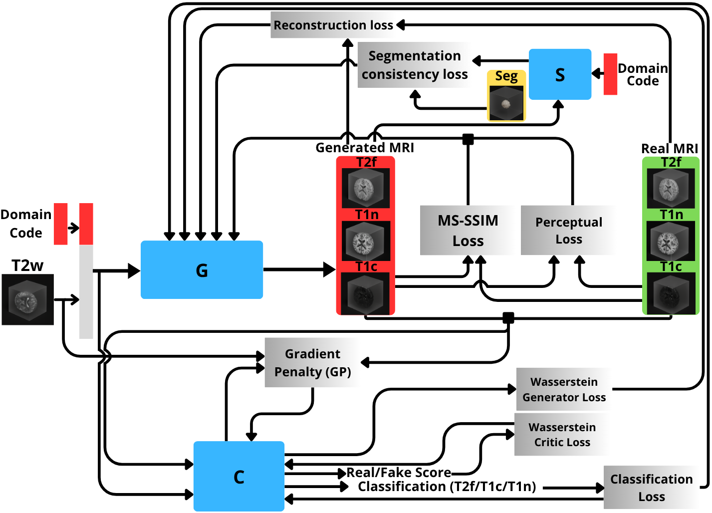
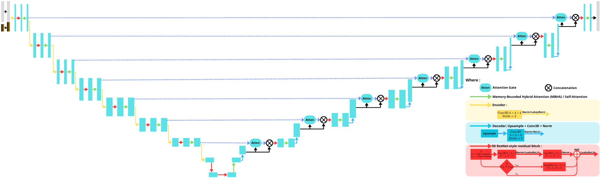
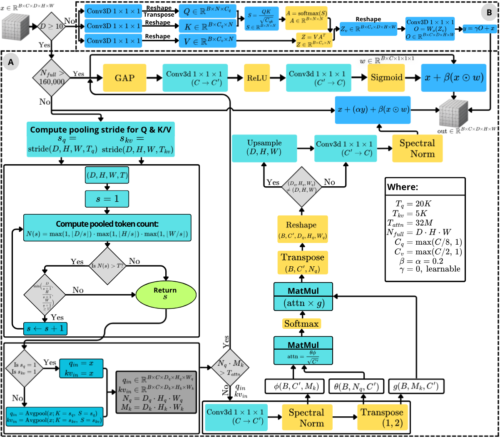
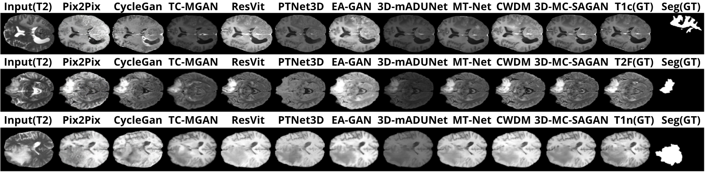

# 3D-MC-SAGAN

<p align="center">
  
  <br>
  <b>Sampling Process Animation</b>
</p>

<hr>

<p align="center">
  
  <br>
  <em>Framework Overview</em>
</p>

<hr>

<p align="center">
  
  <br>
  <b>Generator Architecture</b>
</p>

<p align="center">
  
  <br>
  <b>Memory Bounded Hybrid Attention Block</b>
</p>

<hr>

<p align="center">
  
  <br>
  <em>Comparison Results (T2 vs T2F/T1N/T1C)</em>
</p>


## Experimental Note

During the development of this project, separate code variants were created to conduct **the ablation studies** and **random-search experiments**. This repository contains the final consolidated implementation obtained after those experimental stages and is the run-ready version intended for reproduction and practical use.

## Repository Layout

```text
3D-MC-SAGAN/
├── assets/
│   ├── figures/
│   └── gifs/
├── criteria/
│   ├── loss.py
│   └── losses.py
├── datasets/
│   └── bratsloader.py
├── helpers/
│   └── utils.py
├── models/
│   ├── segmentor.py
│   ├── genrator.py
│   ├── critic.py
│   ├── unet.py
│   └── unet_t2.py
├── Evaluations/
│   ├── segmentation_evalustions/
│   │   ├── train_segmentation.py
│   │   ├── train_segmentation_t2.py
│   │   ├── test_segmentation.py
│   │   ├── test_segmentation_t2.py
│   │   └── README.md
│   ├── mertics_evaluations/
│   │   ├── eval_metrics.py
│   │   └── README.md
│   └── MFD_evaluation/
│       ├── MFD.py
│       ├── data_loader.py
│       ├── environment.yml
│       └── pretrained/
├── data/
├── generated_multi_proc/
├── runs/
├── weight/
├── project_config.py
├── train_segmentor.py
├── train.py
├── test.py
└── environment.yml
```

## Environment

Main environment:

```bash
conda env create -f environment.yml
conda activate mc-sagan
```


For `MFD` evaluation, use the separate environment:

```bash
conda env create -f Evaluations/MFD_evaluation/environment.yml
conda activate 3d-mc-sagan_eval
```

## Data

All paths are controlled from `project_config.py`.

Edit the `DATA` section before running:

- `DATA["gan_train"]`
- `DATA["gan_val"]`
- `DATA["gan_test"]`
- `DATA["train_new"]`

The loader expects each case folder to contain BraTS-style files whose modality token resolves to:

- `t1n`
- `t1c`
- `t2w`
- `t2f`
- `seg`

## Configuration

All runtime settings are in `project_config.py`.

This includes:

- dataset paths
- save paths
- checkpoint paths
- batch sizes
- epochs
- learning rates
- workers
- lambda weights
- validation settings
- output folders

Outputs are project relative by default:

- `weight/`
- `runs/wgan_gp_brats/`
- `generated_multi_proc/`

## Training and Testing Order

### 1. Train the segmentation model used before GAN training

```bash
python train_segmentor.py
```

This writes:

- `weight/unet3d_latest.pth`
- `weight/unet3d_best.pth`

### 2. Train the GAN

```bash
python train.py
```

This writes:

- `runs/wgan_gp_brats/images/`
- `runs/wgan_gp_brats/ckpt/latest.pt`
- `runs/wgan_gp_brats/ckpt/epoch_XXX.pt`
- `runs/wgan_gp_brats/logs/`
- `runs/wgan_gp_brats/figs/`

By default, `train.py` loads the pretrained segmentation checkpoint from:

```text
weight/unet3d_best.pth
```

Resume behavior is controlled from `project_config.py`.

### 3. Generate samples

```bash
python test.py
```

This writes generated outputs to:

```text
generated_multi_proc/
└── <subject_id>/
    ├── flair/
    │   ├── sample.nii.gz
    │   └── target.nii.gz
    ├── t1c/
    │   ├── sample.nii.gz
    │   └── target.nii.gz
    └── t1/
        ├── sample.nii.gz
        └── target.nii.gz
```

Here, `flair` corresponds to `t2f` and `t1` corresponds to `t1n`.

### 4. Train the evaluation segmentation model

```bash
python Evaluations/segmentation_evalustions/train_segmentation.py
```

This writes:

```text
weight/unet3d_brats_binary.pth
```

### 5. Train the T2-only evaluation segmentation model

```bash
python Evaluations/segmentation_evalustions/train_segmentation_t2.py
```

This writes:

```text
weight/unet3d_brats_binary_t2_only.pth
```

### 6. Evaluate with the segmentation models

```bash
python Evaluations/segmentation_evalustions/test_segmentation.py --mode real
python Evaluations/segmentation_evalustions/test_segmentation.py --mode generated
python Evaluations/segmentation_evalustions/test_segmentation_t2.py
```

In `generated` mode, `test_segmentation.py` generates `t1n`, `t1c`, and `t2f` from `t2w` internally before computing Dice.

### 7. Run volume metrics evaluation

```bash
python Evaluations/mertics_evaluations/eval_metrics.py --root generated_multi_proc --device cuda:0
```

This computes `MSE`, `PSNR`, and `SSIM` from the generated NIfTI outputs.

### 8. Run `MFD` evaluation

Download the pretrained ResNet checkpoint and place it under:

```text
Evaluations/MFD_evaluation/pretrained/resnet_50_23dataset.pth
```

Then run:

```bash
python Evaluations/MFD_evaluation/MFD.py \
  --dataset brats \
  --data_root_real /path/to/gan_and_segmentation_test_dataset \
  --data_root_fake generated_multi_proc \
  --pretrain_path Evaluations/MFD_evaluation/pretrained/resnet_50_23dataset.pth \
  --path_to_activations Evaluations/MFD_evaluation/activations_all_modalities \
  --modalities t1n,t1c,t2f \
  --gpu_id 0
```

## Notes

- `weight/`, `runs/`, and `generated_multi_proc/` are created automatically.
- Update `project_config.py` first, then run the scripts.
- The evaluation scripts are under `Evaluations/`.
- `test.py` uses `t2w` as input and writes paired generated/target volumes for each target modality.

## Acknowledgements

We would like to express our sincere gratitude to the authors of the following open-source repositories. Their commitment to open research and their willingness to publicly share their codebases were invaluable to this project. These repositories provided the essential baseline models that made our comparative analysis possible:

* **[3D-mADUNet](https://github.com/juhha/3D-mADUNet)**
* **[PTNet3D](https://github.com/XuzheZ/PTNet3D)**
* **[Ea-GANs](https://github.com/by-lab/Ea-GANs)**
* **[ResViT](https://github.com/icon-lab/ResViT)**
* **[CycleGAN and pix2pix](https://github.com/junyanz/pytorch-CycleGAN-and-pix2pix)**
* **[CWDM](https://github.com/pfriedri/cwdm)**
* **[MT-Net](https://github.com/lyhkevin/MT-Net)**
* **[TC-MGAN](https://github.com/hellopipu/TC-MGAN)**
* **[MedicalNet / Med3D](https://github.com/Tencent/MedicalNet)**

The advancement of medical image synthesis and deep learning relies heavily on such collaborative and transparent efforts.
